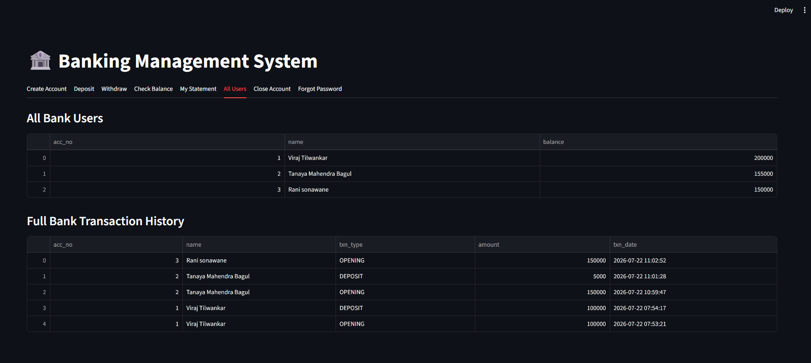
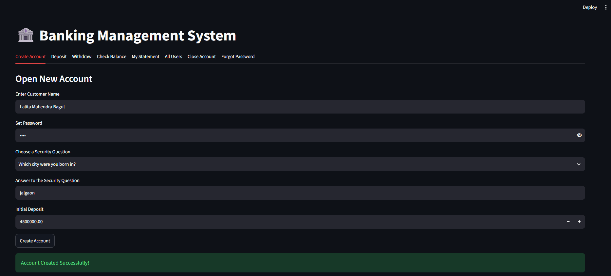
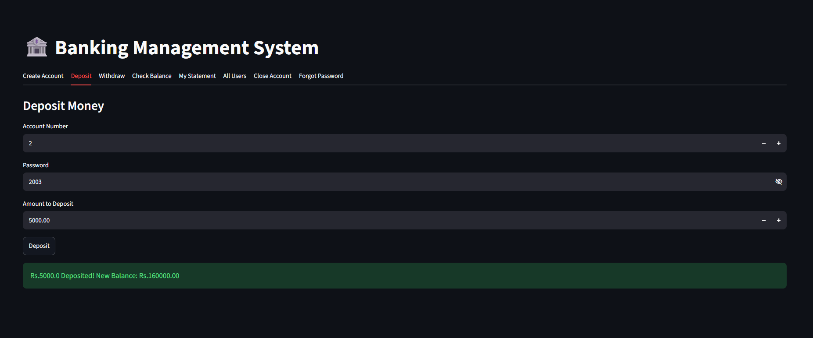
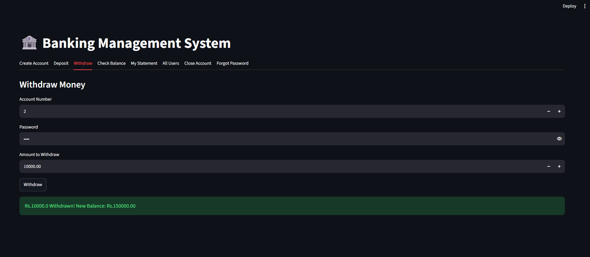
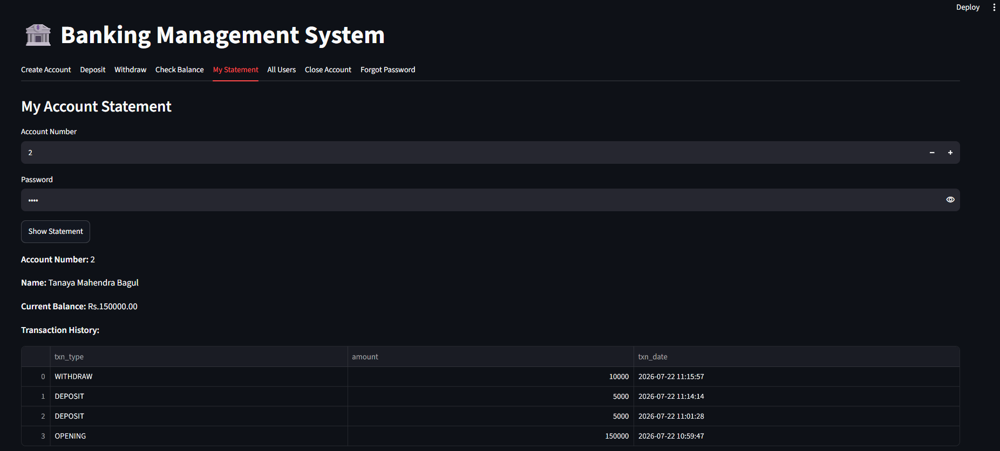

# Bank Management System

A simple **Bank Management System** built with **Python (Streamlit)** for the user interface and **MySQL** for data storage. It allows users to create accounts, deposit and withdraw money, check balance, view transaction history, and manage multiple customers in one place.

## Live Demo

🔗 [Try the App Here](PASTE_YOUR_STREAMLIT_CLOUD_LINK_HERE)

## Features

- Create a new bank account with a unique auto-generated account number
- Deposit and withdraw money with real-time balance updates
- Check account balance instantly
- View a full account statement with complete transaction history
- View all bank users and the full transaction ledger in one place
- Close an existing account
- MySQL database ensures data is permanently stored and safe for multiple users

## Tech Stack

- **Frontend / UI:** Streamlit
- **Backend Language:** Python
- **Database:** MySQL
- **Libraries:** streamlit, mysql-connector-python, pandas

## Application Preview

**Dashboard - All Users**


**Open New Account**


**Deposit Money**


**Withdraw Money**


**Account Statement & History**


## Project Structure

```
bank-management-system/
│
├── banking_app.py        # main streamlit application
├── bank_schema.sql        # mysql database schema
├── requirements.txt       # python dependencies
├── README.md               # project documentation
├── .gitignore                # files ignored by git
└── screenshots/            # app screenshots for readme
```

## Setup Instructions

### 1. Clone the repository
```bash
git clone https://github.com/bagulmtanaya2003-gif/bank-management-system
cd bank-management-system
```

### 2. Install dependencies
```bash
pip install -r requirements.txt
```

### 3. Setup MySQL database
Open MySQL Workbench or MySQL CLI and run the file `bank_schema.sql`. This will create the `bankdb` database along with the `accounts` and `transactions` tables.

### 4. Configure database connection
Open `banking_app.py` and update your MySQL credentials in the `get_connection()` function:
```python
password="YOUR_MYSQL_PASSWORD"
```

### 5. Run the application
```bash
streamlit run app.py
```

The app will open automatically in your browser at `http://localhost:8501`.

## Future Improvements

- Add admin login and authentication
- Add fund transfer between two accounts
- Add email/SMS notification on transactions
- Add password encryption using hashing

## Author

**Your Name**
📧 bagulmtanaya2003@email.com
🔗 [LinkedIn](www.linkedin.com/in/tanaya-bagul-b21354285)
🔗 [GitHub](https://github.com/bagulmtanaya2003-gif)

## License

This project is open source and free to use for learning purposes.